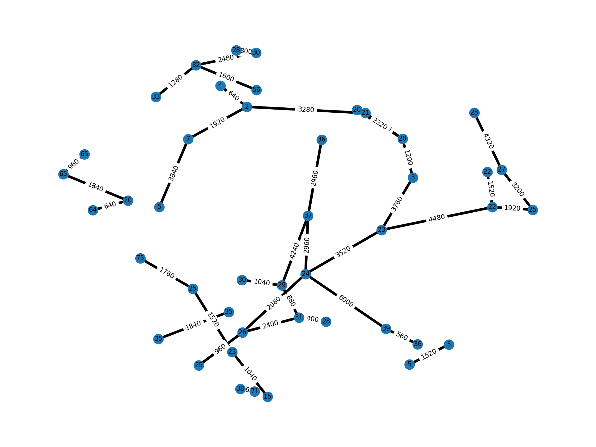
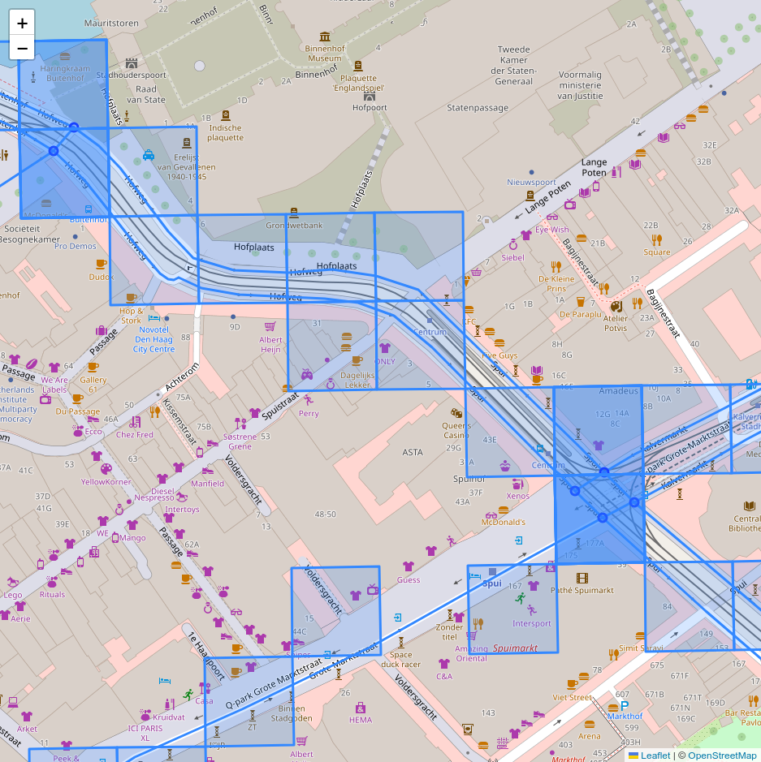
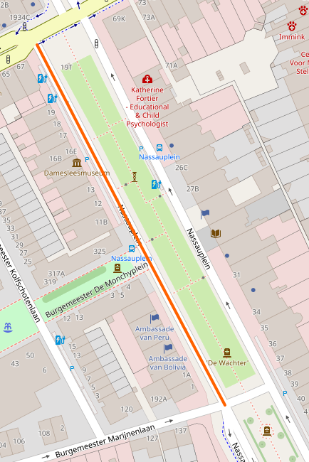
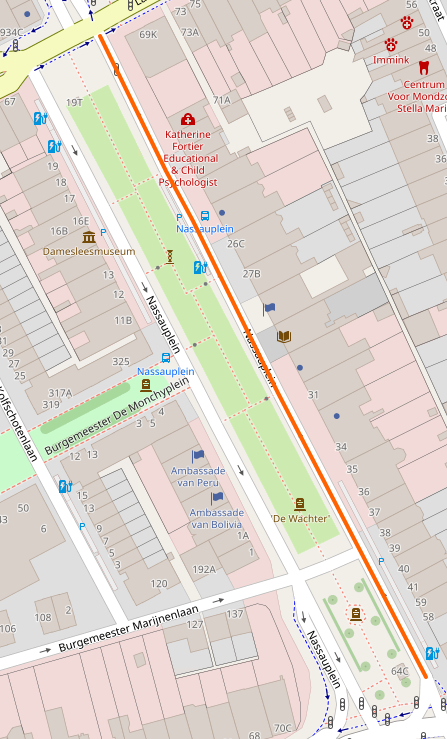

## mar 23 - gh

experiments in shrinking geojson files.

> For most practical applications, you can reduce the coordinate precision to around 6 decimals, roughly equivalent to a scale of around 1cm. This reduces the file size without compromising usability.

what the hell. that's ridiculous. cutting precision will take 40MB to 32, removing spaces gets it to 30.

```
sed -r 's/([0-9]+).([0-9]{4})[0-9]+/\1.\2/g'
```

gzipping the result gets us to 5MB which is'nt far from reasonable. it's 11 if you don't pre-process it like that.


## mar 23 - graph

using the box-based shitty distance measure

made some art


after some label size changes/reweighting, ok, this looks fine actually?????



## mar 23 - dist

how do we determine the length of distance between two numbers? Saskia had the brilliant idea of 'chunking' them, they shouldn't ever be too far apart, so, we can make some blocks and measure that distance.

https://geoforum.nl/t/projection-system/8264/15

maybe this is actually a functional use for RD coordinates?

ok initial naive box drawing algorithm which, while it has nice properties, also has a looot of issues.




clearly suffers from some line segments having lat/lon far apart, we'd need to
generate segments between them, and also line segments unluckily running close
together.

going to try saskia's actual idea of just checking the start/end of line segments and merging where possible.

- if the start/end are sufficiently (>50? m) apart
- AND two line segments have sufficiently close start/end
- then drop one.

but then there's shit like this, how should we detect that they're "equivalent"




## mar 23

Ok, we added a SECOND overpass query and managed to get precise `rcn` nodes IDs which is useful, now we can start aggregating data a bit better

```
{'4.2080127,52.0612275': {'id': '3', 'refs': {'23', '20', '66'}},
 '4.2166675,52.0556241': {'id': '20', 'refs': {'2', '21', '3'}},
 '4.2168461,52.0554781': {'id': '20', 'refs': {'2', '21', '3'}},
 '4.2258843,52.0403075': {'id': '4', 'refs': {'6', '8', '2'}},
 '4.232608,52.0421784': {'id': '2', 'refs': {'7', '21', '20', '4'}},
 '4.2398273,52.0592772': {'id': '21', 'refs': {'2', '20', '22'}},
 '4.2414904,52.0815935': {'id': '23', 'refs': {'3', '24', '22'}},
 '4.2437321,52.0330067': {'id': '7', 'refs': {'13', '2', '5'}},
 '4.2525617,52.064449': {'id': '22', 'refs': {'23', '21', '25'}},
 '4.2528217,52.0648036': {'id': '22', 'refs': {'23', '21', '25'}},
```

what're you? oh, an intersection with a `22` on different corners. Right.

```
 '4.2525617,52.064449': {'id': '22', 'refs': {'23', '21', '25'}},
 '4.2528217,52.0648036': {'id': '22', 'refs': {'23', '21', '25'}},
```

But at least this is closer to constructing a proper graph. We still can't disambiguate

Here's the nodes with label 25, for instance:

```
[52.0574941,4.3982118]
[52.0723934,4.2752660]
[52.0726114,4.2756020]
[52.0722713,4.2755842]
[52.0723127,4.2752728]
[52.0725430,4.2756514]
```

that's right there's 5x 25s within spitting distance of each other, and one somewhere else in Haag/Delftland


## mar 23

added git, re learned where i was, added this log.

got out.actual.geojson rendered, since overpass doesn't return real geojson :shrug:.

## jan 13

we've got some nice queries for the overpass turbo API, which fetches roughly the data we need.

However it doesn't fetch the actual node data that we need, e.g.

```
Node 44751084 ✏
Relations 1

    1852352 network Fietsnetwerk Midden-Delfland

Coordinates

51.989431 / 4.2876399 (lat/lon)
```

and yeah, completely missing from the overpass results.
See e.g. [overpass](https://overpass-turbo.eu/) with a query like:

```
[out:json][timeout:325];
area(id:3600192736)->.searchArea;
nwr["network"="rcn"](area.searchArea);
out geom;
```

the RCN node data just isn't there, except for the ways.
